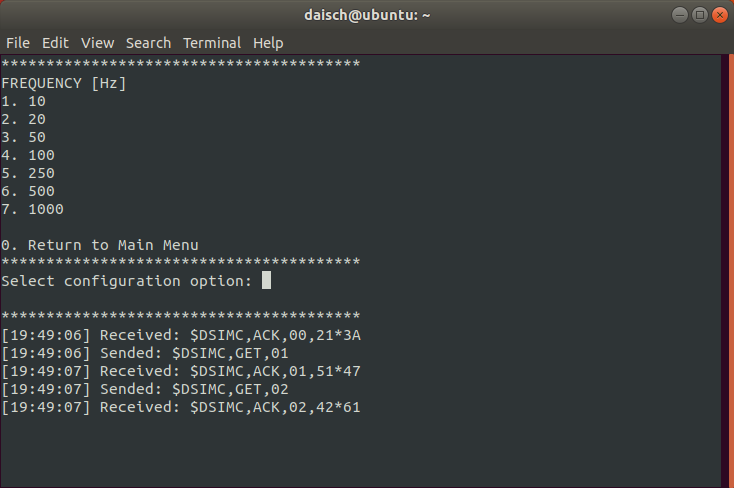

<div align="center">

[](http://www.daisch.com)

# IM1R_ROS_Driver

[](https://github.com/DAISCHSensor/IM1R_ROS_Driver/issues)
[](https://github.com/DAISCHSensor/IM1R_ROS_Driver/pulls)
[]()
[]()
[]()

**English** · [简体中文](./README.zh-CN.md) · [Global Official Site](https://www.daischsensor.com) · [中文官网](https://www.daisch.com)

</div>

---

## Table of Contents

- [IM1R\_ROS\_Driver](#im1r_ros_driver)
  - [Table of Contents](#table-of-contents)
  - [Project Description](#project-description)
  - [Getting Started](#getting-started)
    - [System Requirements](#system-requirements)
    - [Installation Setups](#installation-setups)
  - [Usage Instructions](#usage-instructions)
  - [Published Topics](#published-topics)
  - [Parameters Introductions](#parameters-introductions)
    - [Standard Topic](#standard-topic)
      - [imu/data](#imudata)
      - [temperature](#temperature)
    - [Custom Topic](#custom-topic)
      - [im1r/extra](#im1rextra)
  - [IM1R Configuration Tool](#im1r-configuration-tool)
    - [Starting the Tool](#starting-the-tool)
    - [Changing Configuration Items](#changing-configuration-items)
    - [Notes](#notes)  
  - [FAQ](#faq)
    - [Issue 1: Script Not Found](#issue-1-script-not-found)
  - [Contributing](#contributing)
  - [License](#license)

## Project Description

The project aims to develop and maintain ROS drivers suitable for IM1R products.

## Getting Started

### System Requirements

- Ubuntu 18.04
- ROS Melodic

### Installation Setups

1. Install ROS:
   Please refer to the [ROS installation guide](http://wiki.ros.org/ROS/Installation) for detailed instructions.

2. Create catkin workspace:

   ``` shell
   mkdir -p ~/catkin_ws/src
   ```

3. Clone the project repository to the src directory of your catkin workspace:

   ``` shell
   cd ~/catkin_ws/src
   git clone https://github.com/DAISCHSensor/IM1R_ROS_Driver.git
   ```

4. Build the driver:

   ``` shell
   cd ~/catkin_ws/
   catkin_make
   ```

5. Update the `.bashrc` file:

   ``` shell
   echo "source ~/catkin_ws/devel/setup.bash" >> ~/.bashrc
   source ~/.bashrc
   ```

## Usage Instructions

1. Start the ROS master:

   ``` shell
   roscore
   ```

2. Identify the serial port for the IM1R device:

   ``` shell
   dmesg | grep tty
   ```

3. Set the serial port permissions:
   Assuming the IM1R device is connected to /dev/ttyUSB0:

   ``` shell
   sudo chmod 666 /dev/ttyUSB0
   ```

4. Launch the driver node:

   ``` shell
   rosrun im1r_ros_driver daisch_im1r_node.py /dev/ttyUSB0 115200
   ```

   - `/dev/ttyUSB0` is the serial port.
   - `115200` is the baudrate.

5. List all the topic:

   ``` shell
   rostopic list
   ```

6. echo the specific topic:

   ``` shell
   rostopic echo imu/data
   ```

7. Example of subscribing to  topics (Python):

   ``` shell
   rosrun im1r_ros_driver subscriber_example.py
   ```

## Published Topics

- `imu/data` ([sensor_msgs/Imu](http://docs.ros.org/api/sensor_msgs/html/msg/Imu.html)) quaternion, angular velocity and linear acceleration
- `temperature` ([sensor_msgs/Temperature](http://docs.ros.org/api/sensor_msgs/html/msg/Imu.html)) temperature from device
- `im1r/extra` ([DAISCH Custom Topic](#custom-topic)) extra params from **IM1R**

## Parameters Introductions

### Standard Topic

#### imu/data

| Variable                                     | Supported |
| -------------------------------------------- | --------- |
| time `header.stamp`                          | ✔️        |
| string `header.frame_id`                     | ✔️        |
| float64 `orientation.x`                      | ✘        |
| float64 `orientation.y`                      | ✘        |
| float64 `orientation.z`                      | ✘        |
| float64 `orientation.w`                      | ✘        |
| float64[9] `orientation_covariance`          | ✘        |
| float64 `angular_velocity.x`                 | ✔️        |
| float64 `angular_velocity.y`                 | ✔️        |
| float64 `angular_velocity.z`                 | ✔️        |
| float64[9] `angular_velocity_covariance`     | ✘        |
| float64 `linear_acceleration.x`              | ✔️        |
| float64 `linear_acceleration.y`              | ✔️        |
| float64 `linear_acceleration.z`              | ✔️        |
| float64[9] `linear_acceleration_covariance`  | ✘        |

#### temperature

| Variable                                     | Supported |
| -------------------------------------------- | --------- |
| time `header.stamp`                          | ✔️        |
| string `header.frame_id`                     | ✔️        |
| float64 `temperature`                        | ✔️        |
| float64 `variance`                           | ✘        |

### Custom Topic

#### im1r/extra

| Variable                   | Type       | Definition                                | Unit              | Remarks                                             |
| -------------------------- | ---------- | ----------------------------------------- | ----------------- | --------------------------------------------------- |
| `count`                    | uint8      | Message counter                           | -                 | 0~255 cyclic increment                              |
| `timestamp`                | uint64     | Timestamp of the measurement              | microseconds (µs) | UNIX time                                           |
| `pitch`                    | float64    | Pitch angle                               | degrees (°)       |                                                     |
| `roll`                     | float64    | Roll angle                                | degrees (°)       |                                                     |
| `imu_status`               | uint8      | IMU status indicator                      | -                 | Bit 0: Acceleration valid (0) / invalid (1)<br>Bit 2: Angular velocity valid (0) / invalid (1)<br>Higher bits are not defined   |
| `gyro_bias_x`              | float64    | Gyroscope bias along the X axis           | radians/second (rad/s) |                                                 |
| `gyro_bias_y`              | float64    | Gyroscope bias along the Y axis           | radians/second (rad/s) |                                                 |
| `gyro_bias_z`              | float64    | Gyroscope bias along the Z axis           | radians/second (rad/s) |                                                 |
| `gyro_static_bias_x`       | float64    | Static gyroscope bias along the X axis    | radians/second (rad/s) |                                                 |
| `gyro_static_bias_y`       | float64    | Static gyroscope bias along the Y axis    | radians/second (rad/s) |                                                 |
| `gyro_static_bias_z`       | float64    | Static gyroscope bias along the Z axis    | radians/second (rad/s) |                                                 |

## IM1R Configuration Tool

### Starting the Tool

1. Start the ROS core service:

   ``` shell
   roscore
   ```

2. Identify the serial port of the IM1R device:

   ``` shell
   dmesg | grep tty
   ```

3. Set serial port permissions:
   Assuming the IM1R device is connected to /dev/ttyUSB0:

   ``` shell
   sudo chmod 666 /dev/ttyUSB0
   ```

4. Start the configuration tool:

   ``` shell
   rosrun im1r_ros_driver daisch_im1r_config.py /dev/ttyUSB0
   ```

   - Ensure the serial port connected to IM1R is set to port 2, with a fixed baud rate of 115200.

5. After a successful start, the main interface will display the following content:

   

6. If the serial port connection fails, you will see the information in the image below. Please check if the device is correctly connected and reconfigure the serial port permissions.

   

### Changing Configuration Items

Here are the steps to change the output frequency as an example:

1. Enter  `2` in the main interface and press Enter to enter the submenu:

   

2. Select the desired output frequency from the submenu. After the configuration is successful, the tool will automatically return to the main menu. For example, after setting the output frequency to 50Hz, you can see the setting has been successfully changed in the main menu:

   

### Notes

- The output frequency should match the baud rate. Mismatched baud rates and output frequencies can result in erroneous messages being received.

  | Baud Rate | Maximum Output Frequency |
  | :----: | :----------: |
  | 115200 |    100Hz     |
  | 230400 |    250Hz     |
  | 460800 |    500Hz     |
  | 921600 |    1000Hz    |

## FAQ

### Issue 1: Script Not Found

**Symptom**: Running `rosrun im1r_ros_driver subscriber_example.py` results in the following error:

``` shell
[rosrun] Couldn't find executable named subscriber_example.py below /home/daisch/catkin_ws/src/im1r_ros_driver
[rosrun] Found the following, but they're either not files,
[rosrun] or not executable:
[rosrun]   /home/daisch/catkin_ws/src/im1r_ros_driver/scripts/subscriber_example.py
```

**Solution**: Grant executable permissions to the script:

   ``` shell
   chmod +x /home/daisch/catkin_ws/src/im1r_ros_driver/scripts/subscriber_example.py
   ```

If you have any other questions or need further assistance, feel free to ask.

## Contributing

<a href="https://github.com/DAISCHSensor/IM1R_ROS_Driver/graphs/contributors">
  
</a>

## License

[BSD-3-Clause](./LICENSE)