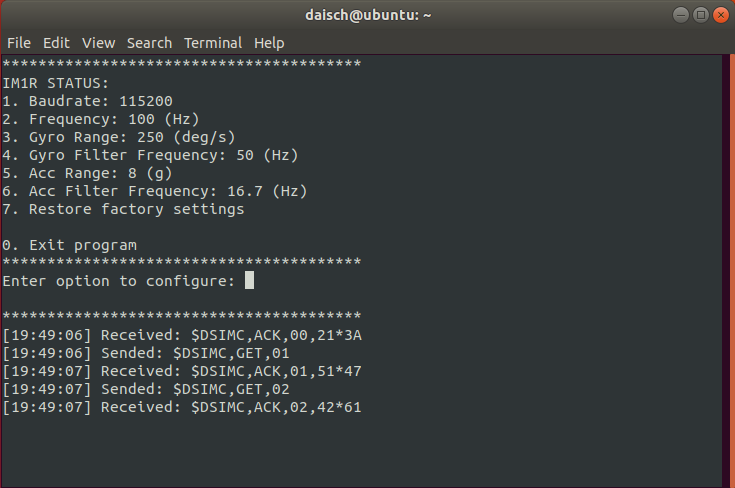
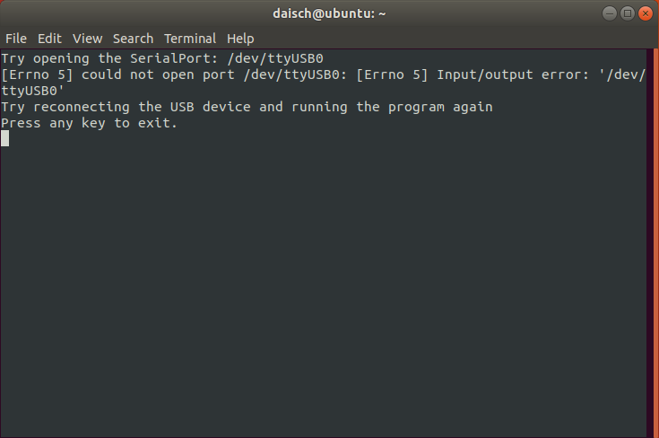
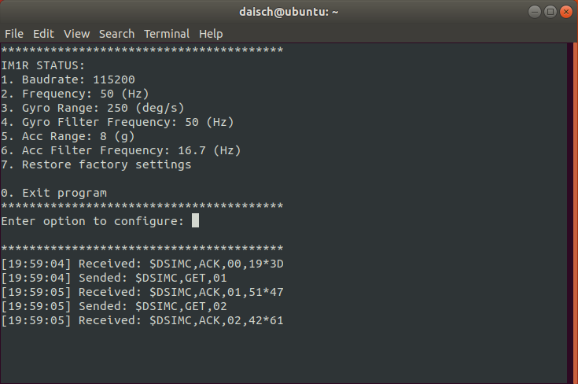

<div align="center">

[](http://www.daisch.com)


# IM1R_ROS_Driver

[](https://github.com/DAISCHSensor/IM1R_ROS_Driver/issues)
[](https://github.com/DAISCHSensor/IM1R_ROS_Driver/pulls)
[]()
[]()
[]()

[English](./README.md) · **简体中文**

</div>

---

## 目录

- [IM1R\_ROS\_Driver](#im1r_ros_driver)
  - [目录](#目录)
  - [项目描述](#项目描述)
  - [入门指南](#入门指南)
    - [系统要求](#系统要求)
    - [安装步骤](#安装步骤)
  - [使用说明](#使用说明)
  - [发布的话题](#发布的话题)
  - [参数介绍](#参数介绍)
    - [标准话题](#标准话题)
      - [imu/data](#imudata)
      - [temperature](#temperature)
    - [自定义话题](#自定义话题)
      - [im1r/extra](#im1rextra)
  - [IM1R配置工具](#im1r配置工具)
    - [启动工具](#启动工具)
    - [更改配置项](#更改配置项)
    - [注意事项](#注意事项)
  - [常见问题解答](#常见问题解答)
    - [问题1：找不到脚本](#问题1找不到脚本)
  - [贡献](#贡献)
  - [许可证](#许可证)

## 项目描述

本项目旨在开发和维护适用于 IM1R 产品的 ROS 驱动程序。

## 入门指南

### 系统要求

- Ubuntu 18.04
- ROS Melodic

### 安装步骤

1. 安装 ROS：
   请参考 [ROS 安装指南](http://wiki.ros.org/ROS/Installation) 获取详细说明。

2. 创建 catkin 工作空间：

   ``` shell
   mkdir -p ~/catkin_ws/src
   ```

3. 克隆项目仓库到 src 目录：

   ``` shell
   cd ~/catkin_ws/src
   git clone https://github.com/DAISCHSensor/IM1R_ROS_Driver.git
   ```

4. 构建工作空间：

   ``` shell
   cd ~/catkin_ws/
   catkin_make
   ```

5. 更新 `.bashrc` :

   ``` shell
   echo "source ~/catkin_ws/devel/setup.bash" >> ~/.bashrc
   source ~/.bashrc
   ```

## 使用说明

1. 启动 ROS 核心服务：

   ``` shell
   roscore
   ```

2. 识别 IM1R 设备的串口：

   ``` shell
   dmesg | grep tty
   ```

3. 设置串口权限：
   假设 IM1R 设备连接到 /dev/ttyUSB0：

   ``` shell
   sudo chmod 666 /dev/ttyUSB0
   ```

4. 启动驱动节点：

   ``` shell
   rosrun im1r_ros_driver daisch_im1r_node.py /dev/ttyUSB0 115200
   ```

   - `/dev/ttyUSB0` is the serial port.
   - `115200` is the baudrate.

5. 列出所有话题：

   ``` shell
   rostopic list
   ```

6. 输出指定话题的内容：

   ``` shell
   rostopic echo imu/data
   ```

7. 订阅话题的示例 (Python)：

   ``` shell
   rosrun im1r_ros_driver subscriber_example.py
   ```

## 发布的话题

- `imu/data` ([sensor_msgs/Imu](http://docs.ros.org/api/sensor_msgs/html/msg/Imu.html)) 四元数、角速度和线性加速度
- `temperature` ([sensor_msgs/Temperature](http://docs.ros.org/api/sensor_msgs/html/msg/Temperature.html)) 来自设备的温度
- `im1r/extra` ([DAISCH 自定义话题](#custom-topic)) 来自 **IM1R** 的额外参数

## 参数介绍

### 标准话题

#### imu/data

| Variable                                     | Supported |
| -------------------------------------------- | --------- |
| time `header.stamp`                          | ✔️        |
| string `header.frame_id`                     | ✔️        |
| float64 `orientation.x`                      | ✘        |
| float64 `orientation.y`                      | ✘        |
| float64 `orientation.z`                      | ✘        |
| float64 `orientation.w`                      | ✘        |
| float64[9] `orientation_covariance`          | ✘        |
| float64 `angular_velocity.x`                 | ✔️        |
| float64 `angular_velocity.y`                 | ✔️        |
| float64 `angular_velocity.z`                 | ✔️        |
| float64[9] `angular_velocity_covariance`     | ✘        |
| float64 `linear_acceleration.x`              | ✔️        |
| float64 `linear_acceleration.y`              | ✔️        |
| float64 `linear_acceleration.z`              | ✔️        |
| float64[9] `linear_acceleration_covariance`  | ✘        |

#### temperature

| Variable                                     | Supported |
| -------------------------------------------- | --------- |
| time `header.stamp`                          | ✔️        |
| string `header.frame_id`                     | ✔️        |
| float64 `temperature`                        | ✔️        |
| float64 `variance`                           | ✘        |

### 自定义话题

#### im1r/extra

| Variable                   | Type       | Definition                                | Unit              | Remarks                                             |
| -------------------------- | ---------- | ----------------------------------------- | ----------------- | --------------------------------------------------- |
| `count`                    | uint8      | Message counter                           | -                 | 0~255 cyclic increment                              |
| `timestamp`                | uint64     | Timestamp of the measurement              | microseconds (µs) | UNIX time                                           |
| `pitch`                    | float64    | Pitch angle                               | degrees (°)       |                                                     |
| `roll`                     | float64    | Roll angle                                | degrees (°)       |                                                     |
| `imu_status`               | uint8      | IMU status indicator                      | -                 | Bit 0: Acceleration valid (0) / invalid (1)<br>Bit 2: Angular velocity valid (0) / invalid (1)<br>Higher bits are not defined   |
| `gyro_bias_x`              | float64    | Gyroscope bias along the X axis           | radians/second (rad/s) |                                                 |
| `gyro_bias_y`              | float64    | Gyroscope bias along the Y axis           | radians/second (rad/s) |                                                 |
| `gyro_bias_z`              | float64    | Gyroscope bias along the Z axis           | radians/second (rad/s) |                                                 |
| `gyro_static_bias_x`       | float64    | Static gyroscope bias along the X axis    | radians/second (rad/s) |                                                 |
| `gyro_static_bias_y`       | float64    | Static gyroscope bias along the Y axis    | radians/second (rad/s) |                                                 |
| `gyro_static_bias_z`       | float64    | Static gyroscope bias along the Z axis    | radians/second (rad/s) |                                                 |

## IM1R配置工具

### 启动工具

1. 启动 ROS 核心服务：

   ``` shell
   roscore
   ```

2. 识别 IM1R 设备的串口：

   ``` shell
   dmesg | grep tty
   ```

3. 设置串口权限：
   假设 IM1R 设备连接到 /dev/ttyUSB0：

   ``` shell
   sudo chmod 666 /dev/ttyUSB0
   ```

4. 启动配置工具：

   ``` shell
   rosrun im1r_ros_driver daisch_im1r_config.py /dev/ttyUSB0
   ```

   - 确保连接到IM1R的串口2，该串口的波特率固定为115200。

5. 启动成功后，主界面会显示以下内容：

   

6. 如果串口连接失败，你会看到下图中的信息，请检查设备是否连接正确，并重新设置串口权限。

   

### 更改配置项

以下是以更改输出频率为例的步骤：

1. 在主界面输入 `2` 并按回车，进入子菜单：

   

2. 在子菜单中选择所需的输出频率。配置成功后，工具会自动返回主菜单。例如，设置为 50Hz 输出频率后，你可以在主菜单中看到设置已成功更改：

   

### 注意事项

- 输出频率应与波特率匹配，设置不匹配的波特率和输出频率会导致接收到错误的报文。

  | 波特率 | 最大输出频率 |
  | :----: | :----------: |
  | 115200 |    100Hz     |
  | 230400 |    250Hz     |
  | 460800 |    500Hz     |
  | 921600 |    1000Hz    |

## 常见问题解答  

### 问题1：找不到脚本

**症状**：运行 `rosrun im1r_ros_driver subscriber_example.py` 时出现以下错误：

``` shell
[rosrun] Couldn't find executable named subscriber_example.py below /home/daisch/catkin_ws/src/im1r_ros_driver
[rosrun] Found the following, but they're either not files,
[rosrun] or not executable:
[rosrun]   /home/daisch/catkin_ws/src/im1r_ros_driver/scripts/subscriber_example.py
```

**解决方案**：授予脚本可执行权限：

   ``` shell
   chmod +x /home/daisch/catkin_ws/src/im1r_ros_driver/scripts/subscriber_example.py
   ```

如果您有任何其他问题或需要进一步的帮助，请随时提出。

## 贡献

<a href="https://github.com/DAISCHSensor/IM1R_ROS_Driver/graphs/contributors">
  
</a>

## 许可证

[BSD-3-Clause](./LICENSE)
